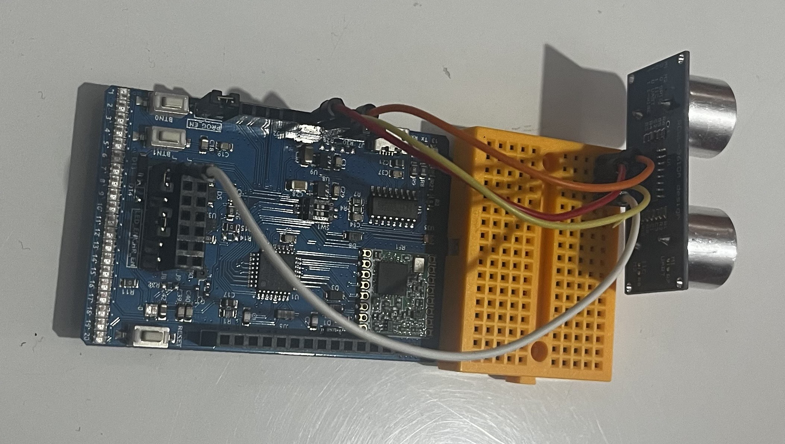

# Systeme de boîte aux lettres intelligente – Détection automatique de courrier et colis

## Idée du projet

Avec mon camarade, on s’est demandé comment éviter de faire des allers-retours inutiles à la boîte aux lettres juste pour vérifier s’il y a du courrier ou un colis.  
On a donc eu l’idée de concevoir un petit dispositif universel, facile à fixer au plafond de n’importe quelle boîte aux lettres, qui peut détecter automatiquement s’il y a eu un dépôt, et surtout, s’il s’agit d’une lettre ou d’un colis.

## Comment ça fonctionne ?

Notre système repose sur un capteur à ultrasons qui mesure en permanence la distance entre le capteur et le fond de la boîte.

Quand on démarre le système, il enregistre une valeur de référence : la distance « vide » (lorsqu’il n’y a encore rien dans la boîte).

Ensuite, il effectue une mesure toutes les 10 secondes. À chaque mesure, il compare la nouvelle distance avec la valeur initiale, et détermine si quelque chose a été déposé.

Mais pour éviter les erreurs d’interprétation, on a mis en place une logique de confirmation sur 3 mesures successives identiques, pour s’assurer à 100 % qu’il s’agit bien d’un courrier ou d’un colis.

## Pourquoi cette logique ?

Dans une boîte aux lettres classique, les lettres sont introduites par le haut, ce qui peut temporairement créer un grand écart de distance détecté par le capteur.  
Si on envoyait directement une alerte à ce moment-là, le système croirait que c’est un colis à cause de cette variation brutale.

Or, ce n’est pas fiable : la lettre, une fois insérée, va simplement tomber au fond de la boîte, et la mesure réelle (une fois stabilisée) sera beaucoup plus petite.

Du coup, on a défini une plage de tolérance claire pour classer les objets détectés :

- Si la différence entre la valeur actuelle et la valeur initiale est **supérieure à 5 cm**, on considère que c’est un **colis**.  
- Si cette différence est **entre 0,4 cm et 5 cm**, on considère que c’est une **lettre**.  
- En dessous de 0,4 cm, on considère qu’il n’y a **rien de nouveau**.

Mais ce n’est pas tout :  
Si une première mesure semble indiquer un colis (valeur > 5 cm), mais que les deux suivantes ne sont pas dans la même plage, alors on annule cette tentative et on redémarre un nouveau cycle de détection.

L’objectif, c’est d’attendre trois mesures consécutives dans le même intervalle, pour être certain que l’objet est bien en place, et que ce n’est pas une fausse alerte due à un simple mouvement temporaire (comme une lettre qui tombe).

## Envoi de l’alerte

Une fois que le système a détecté trois fois de suite la même distance dans un même intervalle (colis ou lettre), il envoie un message via **LoRa**.

Ce message est reçu par un récepteur LoRa, connecté à un système externe (comme un PC ou une passerelle), qui est chargé de transmettre l’information à **Zapier**.

Zapier, de son côté, se charge d’envoyer un email automatique à l’utilisateur avec un message du type :

- “Lettre détectée dans votre boîte aux lettres”
- “Colis détecté dans votre boîte aux lettres”

## Optimisation de la consommation d’énergie

On a aussi réfléchi à l’aspect énergétique du projet.  
Comme on sait que les facteurs passent en général le matin, on a intégré dans notre programme une plage horaire de fonctionnement limitée :  
--> Le système est actif uniquement **entre 6h00 et 14h00**.

Cela permet d’économiser de l’énergie, en évitant de faire des mesures inutiles le reste de la journée, quand les livraisons sont très rares.

Mais attention :  
Si jamais le système ne parvient pas à déterminer correctement l’heure (par exemple en cas de bug ou d’absence de synchronisation), il continue quand même à fonctionner en continu pour ne rater aucune détection importante.

## Matériel requis

- 1 Carte **UCA Education Board** (compatible LoRa)  
- 1 Capteur à ultrasons **HC-SR04**  
- 1 Module récepteur **LoRa**  
- Câbles de connexion (Dupont)  
- Une alimentation (pile ou batterie Li-Ion)  
- Un ordinateur pour la programmation  
- Un compte **Zapier**

## Schéma de câblage

> Sorties utilisées sur le capteur HC-SR04 :

- **Trig** → **A3**  
- **Echo** → **A2**  
- **VCC** → 5V  
- **GND** → GND

## Installation du code

1. Installer l’IDE Arduino.  
2. Installer les bibliothèques suivantes via le **Gestionnaire de bibliothèques** dans l’IDE :

   - `SPI`  
   - `LoRa`  
   - `WER`  
   - `RTClib`  
   - `NewPing`

> Si des erreurs apparaissent ou que vous ne trouvez pas certaines bibliothèques ou la bonne carte, **vous pouvez consulter le GitHub du professeur** :
 https://github.com/FabienFerrero/UCA21  
Vous y trouverez toutes les infos nécessaires sur **l’installation de la carte, les bibliothèques, et les extensions**.

## Configuration de Zapier

### Créer un webhook

1. Va sur [zapier.com](https://zapier.com) et connecte-toi.  
2. Clique sur **“Create Zap”**.  
3. Dans le déclencheur (**Trigger**), choisis :  
   --> **Webhooks by Zapier**  
   --> puis **Catch Hook**  
4. Zapier te fournit une **URL personnalisée** (ex : `https://hooks.zapier.com/...`) → **copie cette URL**.

## Connexion à The Things Stack Sandbox

> Pour relier le système LoRa à Zapier, on utilise **The Things Stack Sandbox**.

Voici les étapes :

1. Va sur **The Things Stack Sandbox** et connecte-toi.  
2. Clique sur **“Applications”**.  
3. Sélectionne **“Laboratoire LoRaWAN”**.  
4. Clique sur **“Webhooks”**.  
5. Clique sur **“Ajouter un webhook”**.  
6. Choisis **Webhook personnalisé**.  
7. Colle l’**URL de Zapier** obtenue précédemment.  
8. Sauvegarde.

## Dernière étape

Maintenant que vous avez réalisé toutes ces étapes-là,  
il ne vous reste plus qu’à **copier-coller le code Arduino fourni**, le **téléverser dans votre carte**,  
et **raccorder proprement les branchements (A3, A2, GND, 5V)** comme indiqué plus haut.  
Et voilà, **le système est prêt à fonctionner**. 

## Idées d’améliorations

- Ajouter une batterie rechargeable avec **panneau solaire**    
- Intégrer la détection dans une **application mobile**  
- Ajouter un **indicateur LED ou buzzer dans la maison**  
- Utiliser **une camera ** pour différencier plus précisément le types de dépôts

## Auteurs

Projet réalisé par **deux étudiants en licence 1 informatique**.  
N’hésitez pas à forker, tester et améliorer !

